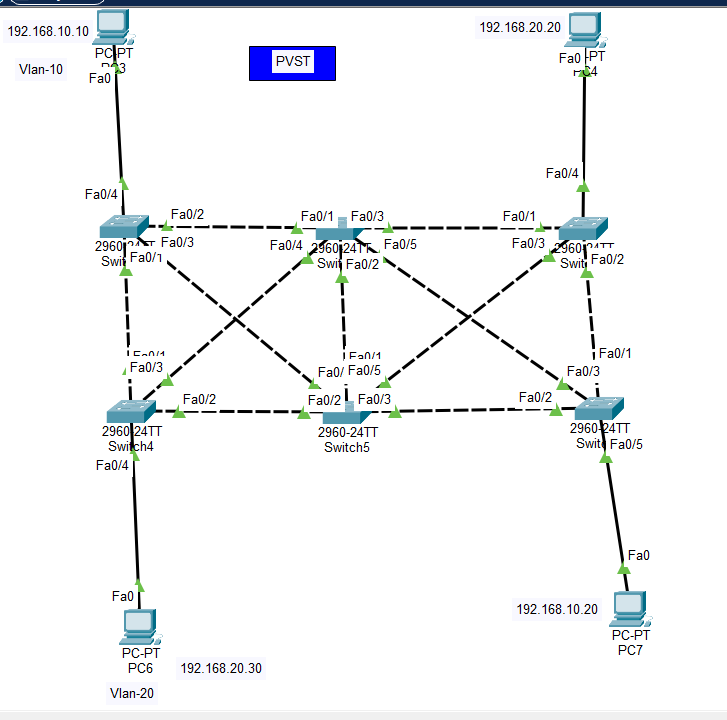

# Implement PVST+

## Overview

This project demonstrates Per-VLAN Spanning Tree Plus (PVST+) using Cisco Packet Tracer.

## Topology

## Topology

## Technologies Used

- Cisco Packet Tracer
- VLAN
- Trunking
- PVST+
- Spanning Tree Protocol (STP)

## VLANs

- VLAN 10
- VLAN 20

## Packet Tracer File

The complete Packet Tracer project is available in this repository.

[Download Implement PVST+.pkt](./Implement%20PVST%2B.pkt)
